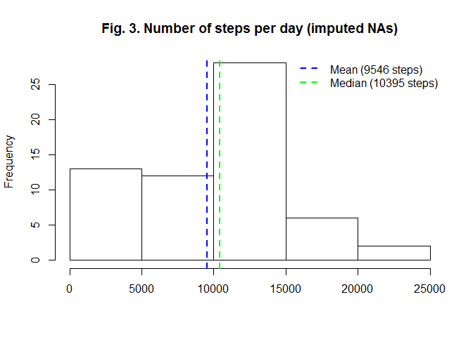
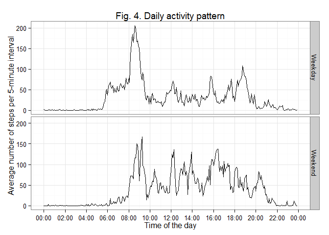

# Reproducible Research: Peer Assessment 1


## Loading and preprocessing the data

```r
options(stringsAsFactors = FALSE)
suppressMessages(library(dplyr))
library(ggplot2)
library(scales)

# Set locale for correct (US) weekdays abbreviation
invisible(Sys.setlocale("LC_TIME", "us"))

# read data
# you should change path according to your system
setwd("c:/Users/gregory/Documents/!Projects/Trainings/Coursera - Reproducible Research/RepData - PA1/")
file_with_data=unzip("activity.zip") 
activity = read.csv(file_with_data,stringsAsFactors=FALSE)
unlink(file_with_data) # delete unzipped file

# quick look at data structure
str(activity)
```

```
## 'data.frame':	17568 obs. of  3 variables:
##  $ steps   : int  NA NA NA NA NA NA NA NA NA NA ...
##  $ date    : chr  "2012-10-01" "2012-10-01" "2012-10-01" "2012-10-01" ...
##  $ interval: int  0 5 10 15 20 25 30 35 40 45 ...
```

```r
# make fields with time format
activity$time = format(strptime(gsub(" ","0",format(activity$interval,width=4)),"%H%M"),"%H:%M")
day_of_week = weekdays(strptime(activity$date,format = "%Y-%m-%d"))

# variable with Weekday/Weekend value
activity$week = factor(ifelse(day_of_week %in% c("Sunday","Saturday"),"Weekend","Weekday"))

rm(day_of_week) # we don't need this var anymore
```
## What is mean total number of steps taken per day?

```r
# aggregate number of steps by day - omit missing values
aggregated_activity = select(na.omit(activity),date,steps) %>% group_by(date) %>% summarize(steps=sum(steps,na.rm = TRUE))

steps_mean = round(mean(aggregated_activity$steps))
steps_median = median(aggregated_activity$steps)
hist(aggregated_activity$steps, main="Fig. 1. Number of steps per day",xlab="")
abline(v=steps_mean,col="blue",lwd=2,lty=2)
abline(v=steps_median,col="green",lwd=2,lty=2)
legend("topright",
       c(sprintf("Mean (%s steps)",steps_mean),sprintf("Median (%s steps)",steps_median)),
       lty=2,lwd=2,
       col=c("blue","green"),
       bty = "n")
```

 

####Table 1. Number of steps

Statistic   | Steps per day
-------|-------------
Mean   | 10766
Median | 10765

## What is the average daily activity pattern?

```r
# aggregation by time (interval)
aggregated_activity_by_interval = select(na.omit(activity),time,steps) %>% group_by(time) %>% summarize(steps=mean(steps,na.rm = TRUE))


qplot(strptime(time,"%H:%M"),steps,
      geom="line",
      data = aggregated_activity_by_interval,
      main="Fig. 2. Daily activity pattern",
      xlab = "Time of the day",
      ylab = "Average number of steps per 5-minute interval") + 
    scale_x_datetime(labels = date_format("%H:00"),breaks = date_breaks("2 hour"))+ 
    theme_bw()
```

 


```r
# maximum number of steps in average
interval_max_steps = max(aggregated_activity_by_interval$steps)
interval_max = aggregated_activity_by_interval[which.max(aggregated_activity_by_interval$steps),"time"]
```

So **average maximum activity is at 08:35 with 206 average number of steps per interval**.


## Imputing missing values

```r
# compute number of cases with missing values
rows_with_na = nrow(activity) - sum(complete.cases(activity))
```

There are 2304 rows with NA. It is about 13% of cases. Strategy for filling NAs - we replace NAs with median number of steps for this time interval from others non-missing dates. We will use data from weekdays for imputing weekdays missing values and accordingly weekends for weekends.


```r
# compute medians
activity_medians = group_by(na.omit(activity),week,interval) %>% summarise(median_steps=median(steps))
activity_nona = left_join(activity,activity_medians) 
```

```
## Joining by: c("interval", "week")
```

```r
# replace missing values
activity_nona = mutate(activity_nona,steps=ifelse(is.na(steps),median_steps,steps))
# check if we replace all NA. Should be TRUE.
sum(is.na(activity_nona$steps)) == 0
```

```
## [1] TRUE
```

```r
rm(activity_medians)

# plot histogramm and compute mean/median without NAs
aggregated_activity_nona = select(activity_nona,date,steps) %>% group_by(date) %>% summarize(steps=sum(steps,na.rm = TRUE))

steps_mean_nona = round(mean(aggregated_activity_nona$steps, na.rm = TRUE))
steps_median_nona = median(aggregated_activity_nona$steps, na.rm = TRUE)
hist(aggregated_activity_nona$steps, main="Fig. 3. Number of steps per day (imputed NAs)",xlab="")
abline(v=steps_mean_nona,col="blue",lwd=2,lty=2)
abline(v=steps_median_nona,col="green",lwd=2,lty=2)
legend("topright",
       c(sprintf("Mean (%s steps)",steps_mean_nona),sprintf("Median (%s steps)",steps_median_nona)),
       lty=2,lwd=2,
       col=c("blue","green"),
       bty = "n")
```

 

##### Table 2. Number of steps. Comparison with imputed NA.

Statistic   | Steps per day | Steps per day (imputed NA's)
-------|--------------------|------------------------------
Mean   | 10766     | 9546
Median | 10765   | 10395

It seems there is frequency increasing of days with low activity. Let's check difference in means with t-test.


```r
t.test(aggregated_activity$steps,aggregated_activity_nona$steps)
```

```
## 
## 	Welch Two Sample t-test
## 
## data:  aggregated_activity$steps and aggregated_activity_nona$steps
## t = 1.392, df = 111.9, p-value = 0.1666
## alternative hypothesis: true difference in means is not equal to 0
## 95 percent confidence interval:
##  -516.2 2956.2
## sample estimates:
## mean of x mean of y 
##     10766      9546
```
p-value is greater than 0.05 so there is no significant difference in means.

## Are there differences in activity patterns between weekdays and weekends?

```r
# aggregation by weekday and time (interval)
aggregated_activity_by_interval_nona = activity_nona %>% group_by(week,time) %>% summarize(steps=mean(steps,na.rm = TRUE))


qplot(strptime(time,"%H:%M"),steps,
      facets = week ~ .,
      geom = "line",
      data = aggregated_activity_by_interval_nona,
      main="Fig. 4. Daily activity pattern",
      xlab = "Time of the day",
      ylab = "Average number of steps per 5-minute interval")  + 
    scale_x_datetime(labels = date_format("%H:00"),breaks = date_breaks("2 hour")) +
    theme_bw()
```

 

So we can draw a conclusion from this plot that steps on weekdays are spreaded more uniformly through the day. Peak activity on weekends is not so high as on weekdays.

### That's all. Thank you for your attention:)

