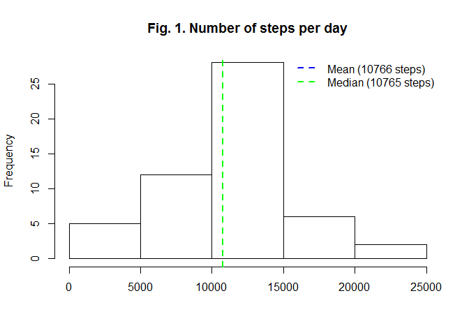
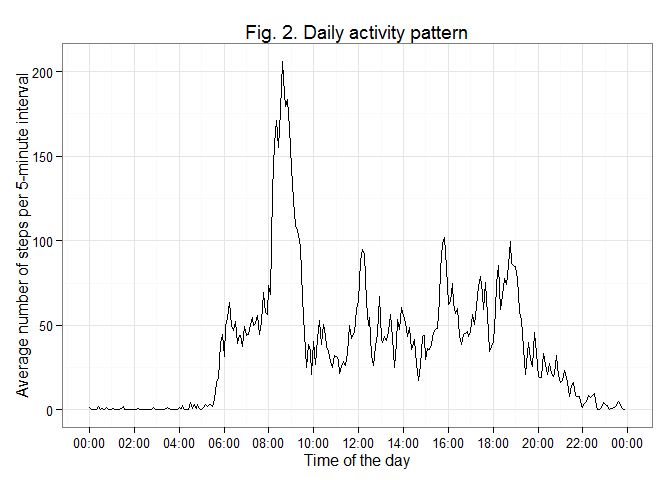

# Reproducible Research: Peer Assessment 1


## Loading and preprocessing the data

```r
suppressMessages(library(dplyr))

# read data
setwd("c:/Users/gregory/Documents/!Projects/Trainings/Coursera - Reproducible Research/RepData - PA1/")
file_with_data=unzip("activity.zip") 
activity = read.csv(file_with_data,stringsAsFactors=FALSE)
unlink(file_with_data) # delete unzipped file

# quick look at data structure
str(activity)
```

```
## 'data.frame':	17568 obs. of  3 variables:
##  $ steps   : int  NA NA NA NA NA NA NA NA NA NA ...
##  $ date    : chr  "2012-10-01" "2012-10-01" "2012-10-01" "2012-10-01" ...
##  $ interval: int  0 5 10 15 20 25 30 35 40 45 ...
```

```r
# make field with datetime format
activity$posix_date = strptime(activity$date,format = "%Y-%m-%d")
activity$time = format(strptime(gsub(" ","0",format(activity$interval,width=4)),"%H%M"),"%H:%M")
```
## What is mean total number of steps taken per day?

```r
# aggregate number of steps by day
aggregated_activity = select(activity,date,steps) %>% group_by(date) %>% summarize(steps=sum(steps,na.rm = TRUE))

steps_mean = round(mean(aggregated_activity$steps))
steps_median = median(aggregated_activity$steps)
hist(aggregated_activity$steps, main="Number of steps per day",xlab="")
abline(v=steps_mean,col="blue",lwd=2,lty=2)
abline(v=steps_median,col="green",lwd=2,lty=2)
legend("topright",
       c(sprintf("Mean (%s steps)",steps_mean),sprintf("Median (%s steps)",steps_median)),
       lty=2,lwd=2,
       col=c("blue","green"),
       bty = "n")
```

 

##### Table 1. Number of steps

Statistic   | Steps per day
-------|-------------
Mean   | 9354
Median | 10395

## What is the average daily activity pattern?

```r
aggregated_activity_by_interval = select(activity,time,steps) %>% group_by(time) %>% summarize(steps=mean(steps,na.rm = TRUE))

interval_max_steps = max(aggregated_activity_by_interval$steps)
interval_max = aggregated_activity_by_interval[which.max(aggregated_activity_by_interval$steps),"time"]
with(aggregated_activity_by_interval,
     plot(strptime(time,"%H:%M"),steps,
     type="l",
     main="Daily activity pattern",
     xlab = "Time",
     ylab = "Average number of steps per 5-minute interval"))
```

 

So we may conclude that average maximum activity is at 08:35 with 206 number of steps .


## Imputing missing values


## Are there differences in activity patterns between weekdays and weekends?
